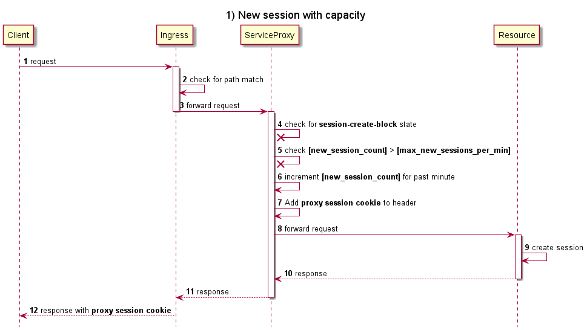
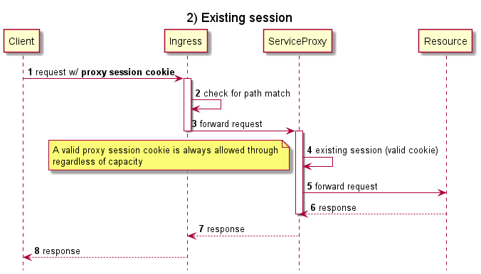
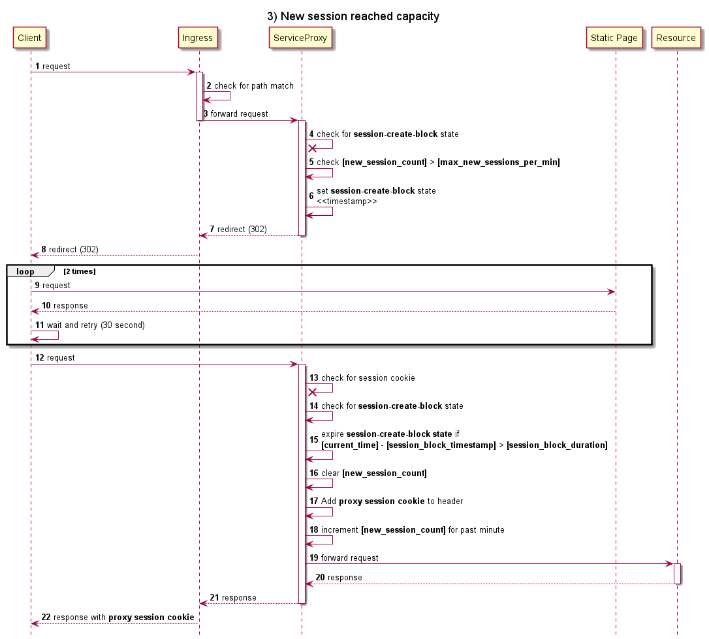

# Virtual Wait Room for Kubernetes Services

This is a proof-of-concept application that demonstrates rate limiting new user sessions for a given workload hosted as services on Kubernetes. It is designed to eliminate the need for code changes on existing services and operate in a flexible, easy to configure manner.

## Overview

This method of rate limiting helps address spikes in new sessions over a rolling one minute window. When new connections exceed the defined limit within the active window, new connection requests are redirected to a static site (Virtual Wait Room) and the URI path is "locked" for a defined period of time.

The following diagram illustrates the basics of the modified traffic flow. A Kubernetes ingress controller, Istio Ingress Gateway in this case, is configured to forward traffic matching a particular path (/auth) to a service that acts as a proxy (ServiceProxy). In this sample, ServiceProxy is implemented with Microsoft's [Yet Another Reverse Proxy (YARP)](https://github.com/microsoft/reverse-proxy) toolkit. If there is capacity in the current new sesion window, an ASP.NET session is created and a *proxy session cookie* is inserted into the request flow and is finally maintained in the browser.

The presence of this cookie, which is sent on subsequent requests, guarantees access to the backend service regardless of the *session create block* status.

In a case where a client is attempting to create a new session and capacity is exceeded in the current window, ServiceProxy redirects the client to a static page. At this point, the proxy enters the *session-create-block* state where all new connection attempts are redirected to the static page until the *session-create-block* state expires (curently 1 minute). JavaScript running on the static page periodically re-tries connecting to the URL path.

## Run and Deploy

Follow the steps in these documents to run and deploy 

* [Deploy infrastructure: Azure Kubernetes Service and Istio Mesh](deployment/README.md)
* [Run services locally and deploy to AKS](services/README.md)

## Test

TBD
