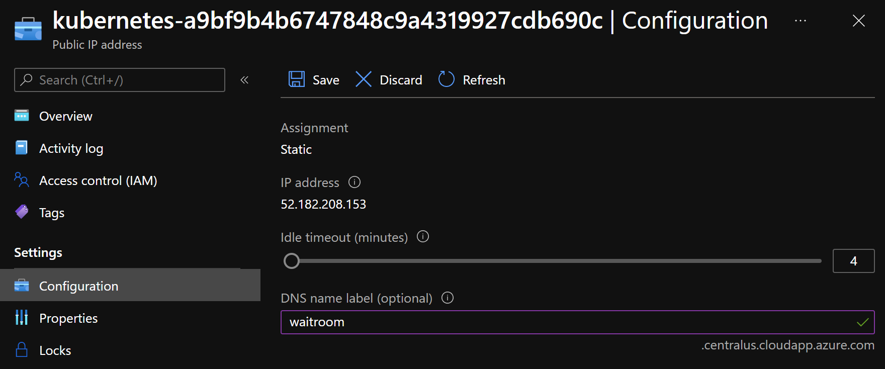

# Deployment

This page outlines the steps to deploy the solution to Azure. You must have the following prerequisites installed and working in your development environment:

* [Azure Bicep](https://github.com/Azure/bicep/releases)
* [Azure CLI](https://docs.microsoft.com/en-us/cli/azure/install-azure-cli)
* [kubectl](https://kubernetes.io/docs/tasks/tools/) (version 1.19+)
* [istioctl](https://docs.microsoft.com/en-us/azure/aks/servicemesh-istio-install?pivots=client-operating-system-linux)

## Service Principal

For local testing and implementation in environments where Managed Identity isn't an option, create a Service Principal. This will be used by the containerized proxy service for accessing Azure Storage and Key Vault as part of [ASP.NET Core Data Protection](https://docs.microsoft.com/en-us/aspnet/core/security/data-protection/configuration/overview?view=aspnetcore-5.0)

```bash
az ad sp create-for-rbac --name proxyservice --skip-assignment
```

Be sure to copy the output of this commmand as this information will be needed for later steps in the deployment. Next, use the `appId` provided in the output to get the object ID for the service principal:

```bash
az ad sp show --id [app_id] --query objectId --out tsv
```

## AKS Cluster

Run the following commands to deploy the cluster.

```bash
bicep build deploy-aks.bicep
az login
az group create --name waitroom-demo --location centralus
az deployment group create --resource-group waitroom-demo --template-file deploy-aks.json --parameters dnsPrefix={your_prefix_here} spObjectId={your_service_principal_object_id}
```

Next, download connection information so that you can connect with the cluster via `kubectl`:

```bash
az aks get-credentials --resource-group waitroom-demo --name waitroom
```

## Istio

Ensure you can communicate with the Run the following comamnds

```bash
istioctl operator init

# confirm success
kubectl get all -n istio-operator

kubectl create ns istio-system
kubectl apply -f istio.aks.yaml

#confirm success
kubectl get all -n istio-system
```

## Set ingress URL

For convenience, set a URL for the public IP address associated to the Istio Ingress Gateway. This can be done by navigating to the IP address that is prefxied with `kubernetes-` within the AKS resource group and providing a label.



>NOTE: Configuration of SSL connections is currently not provided in this repo. Unless convigured otherwise, all tests are accomplished over HTTP.
